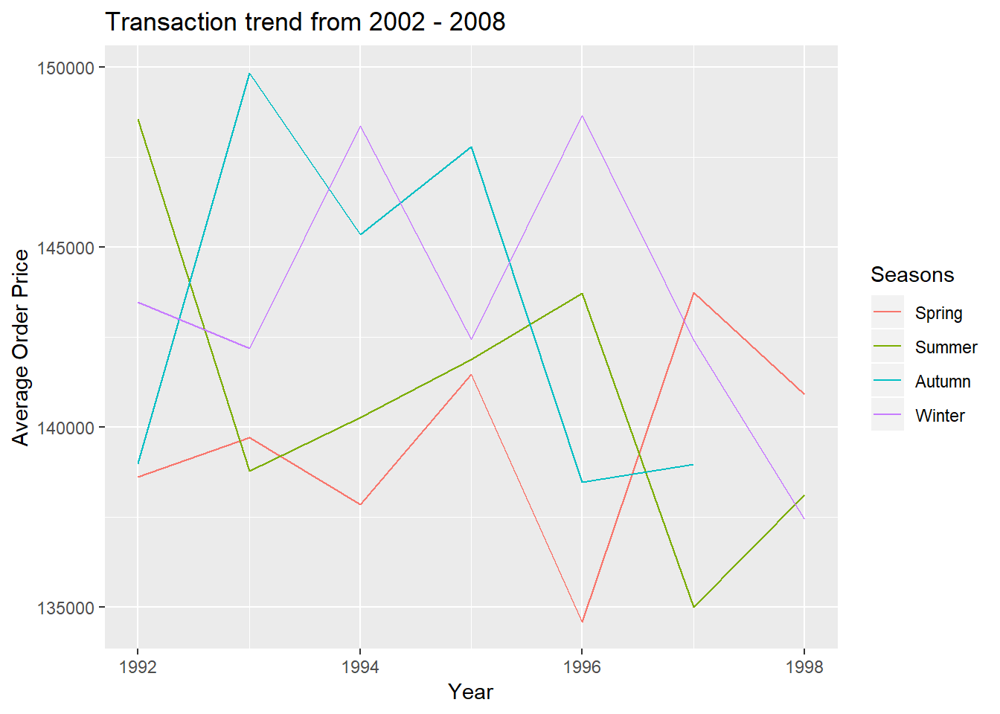
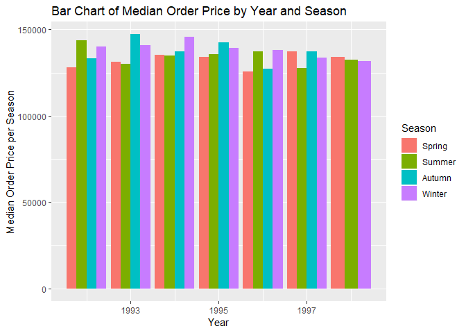
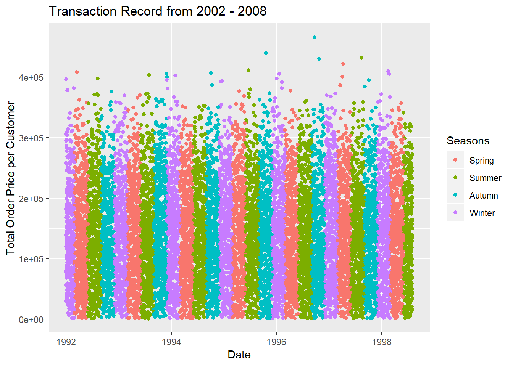
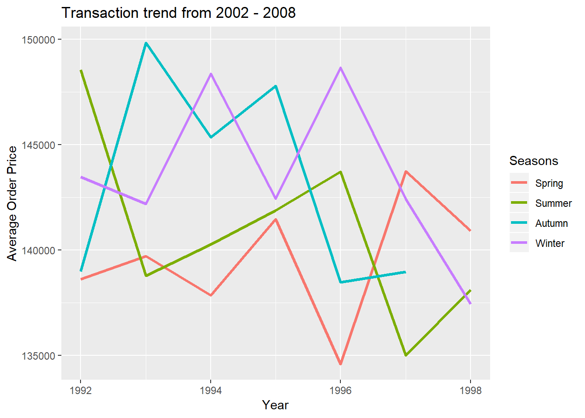
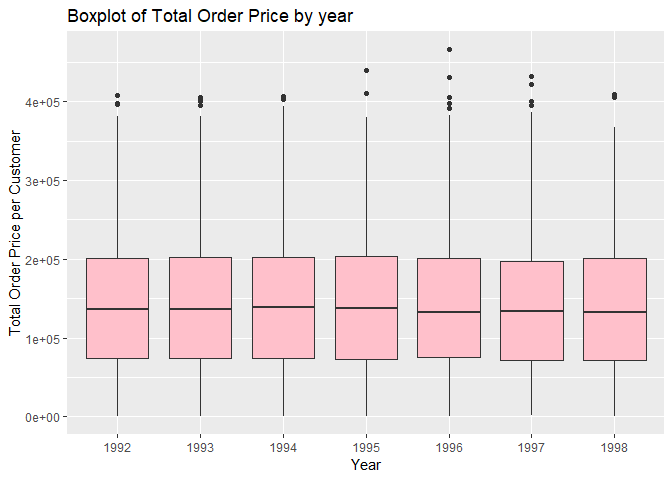

#XML: What is it and why should we use it? <br>

#### What is XML?
Extensible Markup Language, or XML, is a dynamic language that is similar to, but more flexible than HTML.  XML simplifies data sharing as it provides a flexible way to create information formats and electronically share structured data via the internet or corporate networks.<br> 

XML is self-defining, meaning the structure of data is embedded within the data itself. This feature removes the need to pre-build the structure to store the data when attempting to share it.<br>

The main advantage of XML is its simplicity. It enables you to consolidate large chunks of information into an XML document which provides structure and organization to the information. This feature facilitates the rendering of such data in the website environment.<br>

#### Where is it used? 
XML is useful in data transfer. Attempting to share or exchange data in incompatible formats is time consuming at best. As XML stores data in a plain text format, it is a platform independent way of storing and transporting data.

#### Why is it a good way to store data?
XML is a good way to store complex and highly variable data, hierarchical data, and data in which the the format may change over time. 

You can learn more about XML here:<br>
<https://searchmicroservices.techtarget.com/definition/XML-Extensible-Markup-Language>,<br>
<https://www.w3schools.com/xml/xml_whatis.asp><br>
<https://www.sitepoint.com/really-good-introduction-xml/><br>

# Package to read in XML data
####What package(s) should be used to read in XML data?
There are several ways and packages that could be used to read in XML data. The 'XML' package has many online tutorials, help, and trouble shooting resources available. This, along with the fact that it contains many functions that make it easy to access and convert your data make it our recommendation for reading in XML data.

# Reading in data and performing some sample analysis

#### Loading libraries

```r
library(tidyverse)
#requiring more packages that will be helpful later to handle XML data
library(XML)
library(methods)
library(plyr)
library(dplyr)
if (!require(lubridate)) {install.packages("lubridate")}
library(lubridate)
```


#### Reading in XML Data

We found a website with many public XML datasets, some of them contain very interesting information.<br>
[XML data repository](http://aiweb.cs.washington.edu/research/projects/xmltk/xmldata/www/repository.html)<br>
Mondial is an XML dataset from World geographic database integrated from the CIA World Factbook, the International Atlas, and the TERRA database among other sources. The data is made public and downloadable from washington.edu datasets repository online.<br>

However,Mondial has inconsistent number of nodes and/or subnodes throughout the XML content structure. It seems that we can't use standard protocols to fix those. We need to do some ad hoc commands to make that work. As a result we are switching to another more structured dataset called orders from the same repository, with which we had success transforming the XML data in R. Please see the code below. We commented out the lines for Mondial in case we want to challenge ourselves later.


```r
# mondialParse <- xmlParse("http://aiweb.cs.washington.edu/research/projects/xmltk/xmldata/data/mondial/mondial-3.0.xml", useInternalNodes = TRUE)
# class(mondialParse)
# mondialParse

orderParse <- xmlParse("http://aiweb.cs.washington.edu/research/projects/xmltk/xmldata/data/tpc-h/orders.xml")
class(orderParse)
```

```
## [1] "XMLInternalDocument" "XMLAbstractDocument"
```

#### Transforming XML into a Dataframe

```r
# xmlInList <- xmlToList(mondialParse)
# monialDF <- ldply(xmlInList, data.frame)
# Can't use the above methodology because number of nodes and subnodes are not consistent throughout the entire XML structure.

# monialDF <- xmlToDataFrame("http://aiweb.cs.washington.edu/research/projects/xmltk/xmldata/data/mondial/mondial-3.0.xml")
# This does not work either.

xmlInList <- xmlToList(orderParse)
orderDF <- ldply(xmlInList, data.frame)
orderTB <- tbl_df(orderDF)
str(orderTB)
```

```
## Classes 'tbl_df', 'tbl' and 'data.frame':	15001 obs. of  11 variables:
##  $ .id             : chr  "T" "T" "T" "T" ...
##  $ O_ORDERKEY      : Factor w/ 15000 levels "1","2","3","4",..: 1 2 3 4 5 6 7 8 9 10 ...
##  $ O_CUSTKEY       : Factor w/ 1000 levels "370","781","1234",..: 1 2 3 4 5 6 7 8 9 10 ...
##  $ O_ORDERSTATUS   : Factor w/ 3 levels "O","F","P": 1 1 2 1 2 2 1 1 2 1 ...
##  $ O_TOTALPRICE    : Factor w/ 14996 levels "172799.49","38426.09",..: 1 2 3 4 5 6 7 8 9 10 ...
##  $ O_ORDERDATE     : Factor w/ 2401 levels "1996-01-02","1996-12-01",..: 1 2 3 4 5 6 7 8 9 10 ...
##  $ O_ORDER.PRIORITY: Factor w/ 5 levels "5-LOW","1-URGENT",..: 1 2 1 1 1 3 4 4 5 5 ...
##  $ O_CLERK         : Factor w/ 1000 levels "Clerk#000000951",..: 1 2 3 4 5 6 7 8 9 10 ...
##  $ O_SHIP.PRIORITY : Factor w/ 1 level "0": 1 1 1 1 1 1 1 1 1 1 ...
##  $ O_COMMENT       : Factor w/ 14919 levels "blithely final dolphins solve-- blithely blithe packages nag blith",..: 1 2 3 4 5 6 7 8 9 10 ...
##  $ X..i..          : Factor w/ 1 level "orders": NA NA NA NA NA NA NA NA NA NA ...
```
The two quantitative variables are total price and the full order date. The two categorical variables we are going to explore are order priority and order status. For a concise breakdown between quantitative vs categorical variables, please refer to:<br> 
<https://support.minitab.com/en-us/minitab/18/help-and-how-to/statistics/tables/supporting-topics/basics/categorical-and-quantitative-variables/><br>

#### Data Wrangling
All columns of data are parsed into factors, so we need to convert them to character or numeric before manipulating them.

```r
# Remove the last attr row (with NAs) from XML and make a copy so that orderTB is intact
orderTB <- orderTB[-15001,]
orderTB_copy <- orderTB

# start converting columns
orderTB_copy$O_TOTALPRICE <- as.numeric(levels(orderTB$O_TOTALPRICE))[orderTB$O_TOTALPRICE]
orderTB_copy$O_ORDERDATE <- as.character(levels(orderTB$O_ORDERDATE))[orderTB$O_ORDERDATE]

# If f is a factor, as.numeric(levels(f))[f] is more efficient than as.numeric(as.character(f)) according to R documentation. That is what we used above.

# Convert order date from string to date type
d <- orderTB$O_ORDERDATE
parsedDate <- as.Date(d,"%Y-%m-%d")

# Check if date conversion is successful
class(parsedDate)
```

```
## [1] "Date"
```

```r
orderTB_copy$O_ORDERDATE <- parsedDate

str(orderTB_copy)
```

```
## Classes 'tbl_df', 'tbl' and 'data.frame':	15000 obs. of  11 variables:
##  $ .id             : chr  "T" "T" "T" "T" ...
##  $ O_ORDERKEY      : Factor w/ 15000 levels "1","2","3","4",..: 1 2 3 4 5 6 7 8 9 10 ...
##  $ O_CUSTKEY       : Factor w/ 1000 levels "370","781","1234",..: 1 2 3 4 5 6 7 8 9 10 ...
##  $ O_ORDERSTATUS   : Factor w/ 3 levels "O","F","P": 1 1 2 1 2 2 1 1 2 1 ...
##  $ O_TOTALPRICE    : num  172799 38426 205654 56001 105368 ...
##  $ O_ORDERDATE     : Date, format: "1996-01-02" "1996-12-01" ...
##  $ O_ORDER.PRIORITY: Factor w/ 5 levels "5-LOW","1-URGENT",..: 1 2 1 1 1 3 4 4 5 5 ...
##  $ O_CLERK         : Factor w/ 1000 levels "Clerk#000000951",..: 1 2 3 4 5 6 7 8 9 10 ...
##  $ O_SHIP.PRIORITY : Factor w/ 1 level "0": 1 1 1 1 1 1 1 1 1 1 ...
##  $ O_COMMENT       : Factor w/ 14919 levels "blithely final dolphins solve-- blithely blithe packages nag blith",..: 1 2 3 4 5 6 7 8 9 10 ...
##  $ X..i..          : Factor w/ 1 level "orders": NA NA NA NA NA NA NA NA NA NA ...
```

#### Variable Creation
Create a variable to indicate which season the order was made. Use the definition of seasons from the northern hemisphere.

```r
m <- month(orderTB_copy$O_ORDERDATE)

# Use ifelse for vectorized operation
Season <- ifelse(m >= 3 & m <= 5, "Spring", ifelse(m >= 6 & m <= 8, "Summer", ifelse(m >= 9 & m <= 11, "Autumn", "Winter")))

# Convert Season into a factor with defined levels (so that the seasons are sorted properly in the aggregation)
orderTB_copy$Season <- factor(Season, levels = c("Spring", "Summer", "Autumn", "Winter"))
orderTB_copy$Year <- as.integer(year(orderTB_copy$O_ORDERDATE))

# Reorder O_Order.Priority
orderTB_copy$O_ORDER.PRIORITY <- ordered(orderTB_copy$O_ORDER.PRIORITY, levels = c("5-LOW","4-NOT SPECIFIED", "3-MEDIUM", "2-HIGH", "1-URGENT"))
```

#### Aggregation Summary
Use the order date and the newly created season variable to aggregate some data; mean and median by year/season, and standard deviation by season.

```r
# Since dplyr and plyr are invoked together, we need to specify dplyr::group_by and dplyr::summarize. Otherwise, we will get only 1 row of summary.
sumOrderData <- orderTB_copy %>% dplyr::group_by(Year, Season) %>% dplyr::summarize(meanPrice = mean(O_TOTALPRICE, na.rm = TRUE), medianPrice = median(O_TOTALPRICE, na.rm = TRUE), sdPrice = sd(O_TOTALPRICE, na.rm = TRUE))
sumOrderData
```

```
## # A tibble: 27 x 5
## # Groups:   Year [?]
##     Year Season meanPrice medianPrice sdPrice
##    <int> <fct>      <dbl>       <dbl>   <dbl>
##  1  1992 Spring   138614.     128124.  83146.
##  2  1992 Summer   148564.     143726.  85700.
##  3  1992 Autumn   138995.     133195.  78980.
##  4  1992 Winter   143478.     139983.  81982.
##  5  1993 Spring   139712.     131084.  81717.
##  6  1993 Summer   138794.     130109.  83893.
##  7  1993 Autumn   149850.     147171.  84223.
##  8  1993 Winter   142190.     141055.  83635.
##  9  1994 Spring   137856.     135319.  79566.
## 10  1994 Summer   140266.     134841.  82471.
## # ... with 17 more rows
```

```r
# Looking at standard deviation by season using tapply from base package.
tapply(X=orderTB_copy$O_TOTALPRICE, INDEX = orderTB_copy$Season, FUN = sd)
```

```
##   Spring   Summer   Autumn   Winter 
## 81425.90 82657.53 82894.95 84085.57
```

```r
# In addition to Year/season, we try to summarise by order status/season.
sumOrderData2 <- orderTB_copy %>% dplyr::group_by(O_ORDERSTATUS, Season) %>% dplyr::mutate(meanPrice = mean(O_TOTALPRICE, na.rm = TRUE), medianPrice = median(O_TOTALPRICE, na.rm = TRUE), sdPrice = sd(O_TOTALPRICE, na.rm = TRUE))
sumOrderData2
```

```
## # A tibble: 15,000 x 16
## # Groups:   O_ORDERSTATUS, Season [11]
##    .id   O_ORDERKEY O_CUSTKEY O_ORDERSTATUS O_TOTALPRICE O_ORDERDATE
##    <chr> <fct>      <fct>     <fct>                <dbl> <date>     
##  1 T     1          370       O                  172799. 1996-01-02 
##  2 T     2          781       O                   38426. 1996-12-01 
##  3 T     3          1234      F                  205654. 1993-10-14 
##  4 T     4          1369      O                   56001. 1995-10-11 
##  5 T     5          445       F                  105368. 1994-07-30 
##  6 T     6          557       F                   45523. 1992-02-21 
##  7 T     7          392       O                  271886. 1996-01-10 
##  8 T     32         1301      O                  198666. 1995-07-16 
##  9 T     33         670       F                  146567. 1993-10-27 
## 10 T     34         611       O                   73315. 1998-07-21 
## # ... with 14,990 more rows, and 10 more variables:
## #   O_ORDER.PRIORITY <ord>, O_CLERK <fct>, O_SHIP.PRIORITY <fct>,
## #   O_COMMENT <fct>, X..i.. <fct>, Season <fct>, Year <int>,
## #   meanPrice <dbl>, medianPrice <dbl>, sdPrice <dbl>
```

#### Bar Plots

```r
# Bar chart of transcation count by year and season
bar1 <- ggplot(orderTB_copy, aes(x = Year))
bar1 + geom_bar(aes(fill = Season)) + labs(x = "Year", y = "Transaction Counts", title = "Transaction Record from 1992 - 1998")
```

<!-- -->

```r
# Bar chart of median order price by order status and season
bar3 <- ggplot(sumOrderData2, aes(x= O_ORDERSTATUS, y = medianPrice))
bar3 + geom_bar(aes(fill=Season), stat = "identity", position = "dodge") + labs(x = "Order Status", y = "Median Order Price", title = "Bar Chart of Median Order Price by Order Status and Season")
```

<!-- -->

#### Scatter Plots with Coloring

```r
scatter <- ggplot(orderTB_copy, aes(x = O_ORDERDATE, y = O_TOTALPRICE)) 
scatter + geom_point(aes(col = Season)) + labs(x = "Date", y = "Total Order Price per Customer", title = "Transaction Record from 1992 - 1998", color = "Seasons")
```

<!-- -->

```r
#This plot is too dense to gain valuable insight.  We will try a line plot with a summary measure to see if we can more easily identify trends.
```


```r
l <- ggplot(sumOrderData, aes(x = Year, y = meanPrice, color = Season))
l + geom_line(lwd = 1.2) + labs(x = "Year", y = "Average Order Price", title = "Transaction trend from 2002 - 2008", color = "Seasons")
```

<!-- -->

####Box Plots

```r
b1 <- ggplot(orderTB_copy, aes(x = as.factor(Year), y = O_TOTALPRICE))  + geom_boxplot(fill = "pink") + labs(x = "Year", y = "Total Order Price per Customer", title = "Boxplot of Total Order Price by year")
b1
```

<!-- -->


```r
b2 <- ggplot(orderTB_copy, aes(x = as.factor(Year), y = O_TOTALPRICE, fill = Season))  + geom_boxplot() + labs(x = "Year", y = "Total Order Price per Customer", title = "Boxplot of Total Order Price by Year and Season")
b2
```

<!-- -->

```r
#Bar chart of median order price by year and season

g<-ggplot(sumOrderData, aes(x= Year, y = medianPrice))
```


#### Frequency count tables for other categorical variables

```r
#Frequency table
table(orderTB_copy$O_ORDER.PRIORITY, orderTB_copy$Season)
```

```
##                  
##                   Spring Summer Autumn Winter
##   5-LOW              813    772    661    704
##   4-NOT SPECIFIED    840    756    676    752
##   3-MEDIUM           810    746    645    740
##   2-HIGH             830    773    703    759
##   1-URGENT           792    740    706    782
```

####Create a custom function
We created a function that calculates how much money a specific customer has spent with the company and the date range in which this occured.

```r
getTotalperCust<-function(df, variable){
  # if statement and a stop/error to validate that the customer entered is valid
  if(!(variable%in%df$O_CUSTKEY)){
    stop("Customer does not exist,please try again with a valid customerKey")
  }
  
  tot<- df %>% filter(O_CUSTKEY == variable) %>% dplyr::summarise(totPercust = sum(O_TOTALPRICE))
  minyear<- df %>% filter(O_CUSTKEY == variable) %>% summarise(miny<-min(Year))
  maxyear<- df %>% filter(O_CUSTKEY == variable) %>% summarise(maxy<-max(Year))
  
  return(list(TotalMoneySpent = paste0("Customer ", variable, " has spent $", tot, " between ", minyear, " and ", maxyear, ".")))
}
# Checking how many observations the data set has for Cusomer number 1
customerNum1 <- filter(orderTB_copy, O_CUSTKEY == 1)
customerNum1 # 9 Observations
```

```
## # A tibble: 9 x 13
##   .id   O_ORDERKEY O_CUSTKEY O_ORDERSTATUS O_TOTALPRICE O_ORDERDATE
##   <chr> <fct>      <fct>     <fct>                <dbl> <date>     
## 1 T     9154       1         O                  357345. 1997-06-23 
## 2 T     14656      1         O                   28600. 1997-11-18 
## 3 T     24322      1         O                  231040. 1997-01-29 
## 4 T     31653      1         F                  152411. 1993-06-05 
## 5 T     34019      1         O                   89230. 1998-03-29 
## 6 T     36422      1         O                  270087. 1997-03-04 
## 7 T     43879      1         F                   83096. 1993-08-13 
## 8 T     52263      1         F                   51135. 1994-05-08 
## 9 T     53283      1         O                  165928. 1995-10-29 
## # ... with 7 more variables: O_ORDER.PRIORITY <ord>, O_CLERK <fct>,
## #   O_SHIP.PRIORITY <fct>, O_COMMENT <fct>, X..i.. <fct>, Season <fct>,
## #   Year <int>
```

```r
getTotalperCust(orderTB_copy, 1110)
```

```
## Error in getTotalperCust(orderTB_copy, 1110): Customer does not exist,please try again with a valid customerKey
```

```r
getTotalperCust(orderTB_copy, 1369)
```

```
## $TotalMoneySpent
## [1] "Customer 1369 has spent $3011056.6 between 1992 and 1998."
```

```r
getTotalperCust(orderTB_copy, 730)
```

```
## $TotalMoneySpent
## [1] "Customer 730 has spent $3154038.5 between 1992 and 1998."
```
